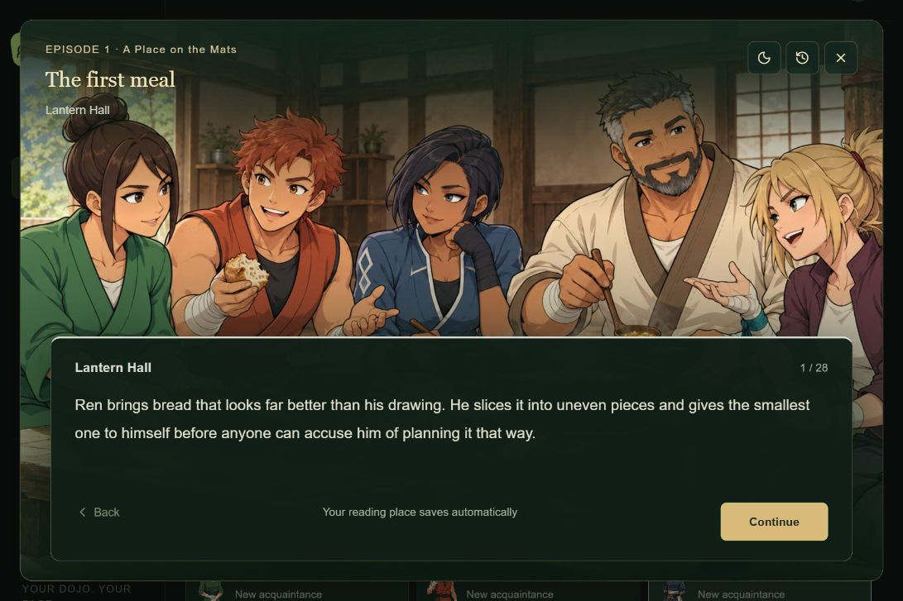

# Dojo

Created by **Radhe Patel**.

Dojo combines a personal beginner martial arts practice with an authored anime story in Amahara. Completed 30–45 minute practices open the next scene at Lantern Hall. Five founders have their own personalities, relationships, obligations, and personal arcs.

[Open Dojo](https://lee-dojo.radherpatel7.chatgpt.site)



Chapter 1 includes eight episodes and 48 main story beats, a prologue, 20 personal conversations, five optional adult relationship invitations, and six supporting visits. The hall has optional facilities, companion jobs, saved reading places, original-choice replays, and durable practice timers. Wednesday is full rest. Recovery practices earn the same rewards, and time away never removes trust.

Training rank remains **Level 1 Beginner**. Finishing the story or collecting rewards does not establish martial arts competence. The ten-stage roadmap requires new curriculum and coached assessments for later levels.

## Local setup

Use Node.js 24 or later and npm. Run these commands from the project folder:

```sh
npm run install:ci
npm run build
npm run db:local
npm run dev
```

The local preview is normally `http://127.0.0.1:5173/`. Loopback development has a local sign-in identity; the hosted app retains its existing account integration. The local database and installed dependencies are ignored by Git.

`db:local` applies pending migrations to the local database only. It is safe to run again. A fresh checkout starts with no local training records; production saves stay on the hosted service.

## Checks

```sh
npm run typecheck
npm test
npm run build
```

With the local preview running, `npm run test:api` checks authentication, saved-session timing, journal protection, and concurrent reward writes. It only accepts loopback URLs and restores its local fixtures afterward. Set `DOJO_TEST_ORIGIN` to use a different local port.

## Project guide

- [Current status and source map](docs/project-status.md)
- [Story authoring and persistence rules](docs/story-authoring.md)
- [Future roadmap](docs/roadmap.md)
- [Writer bible — future spoilers](docs/writer-bible.md)
- [Art direction and source files](artwork/README.md)
- [Contributor instructions](AGENTS.md)

The repository includes the complete app, migration history, delivery artwork, all 67 selected source illustrations, and reusable checks. Credentials, live account data, caches, and dependencies are kept outside version control.

## Hosting

The existing private Sites app is declared in `.openai/hosting.json`. Keep its project ID and access policy. GitHub is the source repository; pushing here does not deploy the app. Publishing uses the normal Sites workflow with a build from the exact source commit.

Required third-party license notices are retained alongside vendored code.
