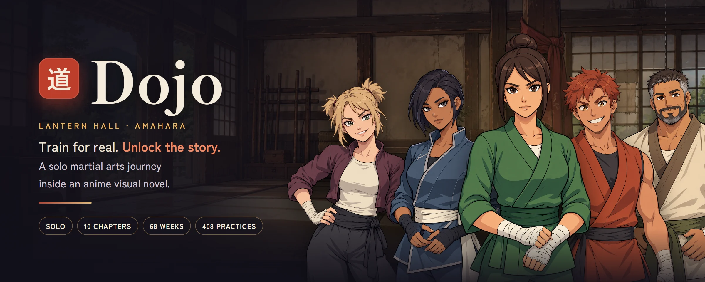
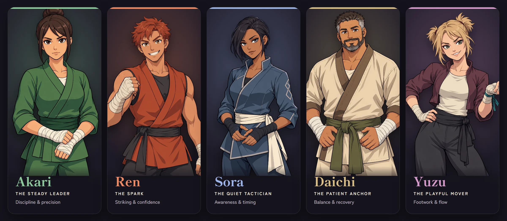
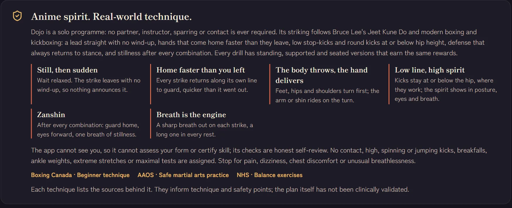
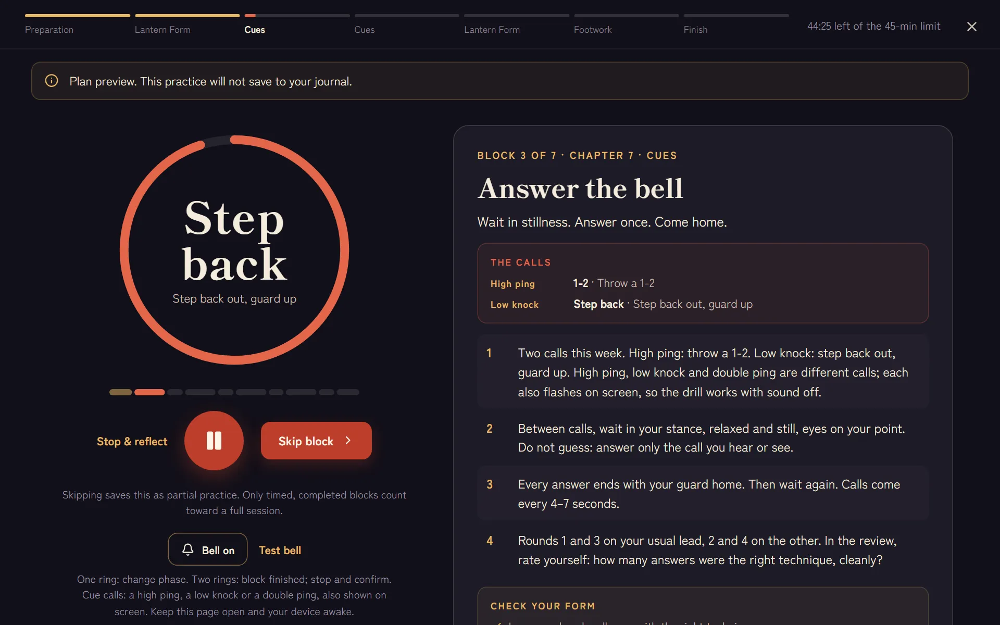
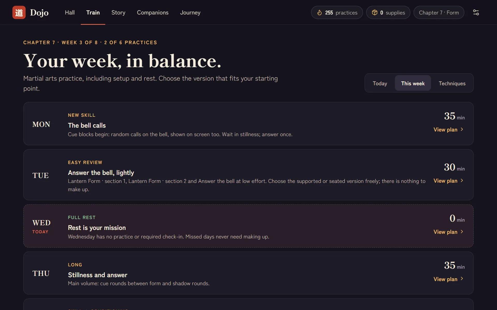
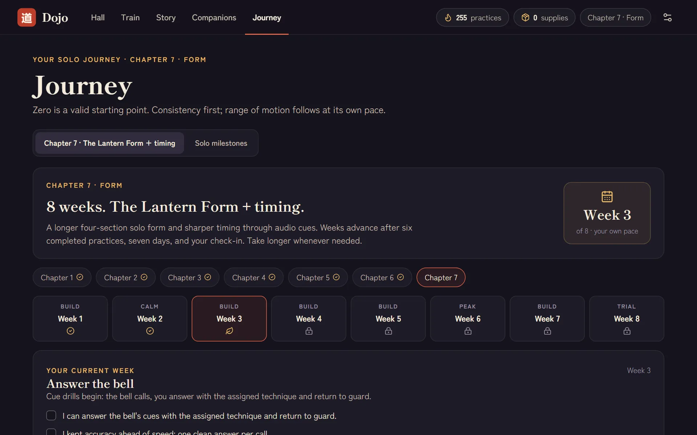
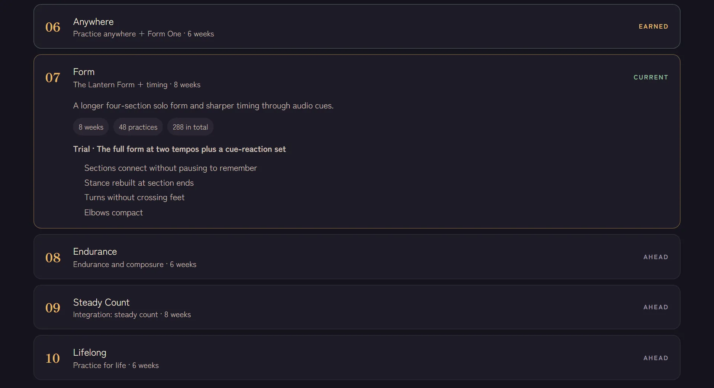

<p align="center">
  
</p>

<h3 align="center">Real martial arts practice. An anime story you unlock by showing up.</h3>

<p align="center">
  
  
  
  
  
</p>

<p align="center">
  <b>Dojo</b> is a Windows desktop app by <b>Radhe Patel</b>. Each 30–40 minute practice you finish opens the next episode of a visual novel set in <b>Lantern Hall</b>, an old training hall in the mountain town of <b>Amahara</b>.
</p>

---

## 🏮 Meet the founders

<p align="center">
  
</p>

Five adult founders, each with their own personality, training focus and life beyond the hall. Practise with any founder you have met, and their bond grows with every session you complete together.

| | Founder | Focus | First words |
|:-:|---|---|---|
| 🟢 | **Akari** · *the steady leader* | Discipline & precision | *"Start where you are. We can work with that."* |
| 🟠 | **Ren** · *the spark* | Striking & confidence | *"You showed up. That's something to build on."* |
| 🔵 | **Sora** · *the quiet tactician* | Awareness & timing | *"A small step still changes your position."* |
| 🟡 | **Daichi** · *the patient anchor* | Balance & recovery | *"There is no hurry. We are building something that lasts."* |
| 🟣 | **Yuzu** · *the playful mover* | Footwork & flow | *"Let's see what one careful step can do."* |

---

## ⛩️ How it works

<table>
  <tr>
    <td width="33%" valign="top">
      <h3>1 · Practise</h3>
      Pick how your body feels today, then follow a guided session: preparation, timed technique blocks with a ringing bell, and a cool-down. Every drill has <b>standing, chair-supported and seated</b> versions, and all three earn the same rewards.
    </td>
    <td width="33%" valign="top">
      <h3>2 · Unlock</h3>
      A completed practice opens the next episode, with choices, callbacks and fully posed character art. Episodes wait for you; time away never costs trust.
    </td>
    <td width="33%" valign="top">
      <h3>3 · Grow</h3>
      Build bonds, open personal conversations, fund hall projects and earn solo milestones. <b>Wednesday is always a full rest day</b>, and there are no absence penalties.
    </td>
  </tr>
</table>

---

## 🥋 Train like an anime hero, for real

The fighting style builds on **Bruce Lee's Jeet Kune Do** and the boxing and kickboxing it borrowed from. The anime feel comes from presentation that is also good practice: opening and closing bows, two complete solo forms with a kiai, stillness after every combination, shadow rounds against an opponent you picture in front of you, and bell drills where the bell is your opponent stepping in and you hit first.

<p align="center">
  
</p>

| Principle | In practice |
|---|---|
| **Still, then sudden** | Strikes leave from relaxed stillness with no wind-up |
| **Home faster than you left** | Every strike returns along its own line to guard |
| **The body throws, the hand delivers** | Feet, hips and shoulders turn first; the arm or shin rides on the turn |
| **Low line, high spirit** | Kicks stay at or below the hip, where they work against a real person |
| **Zanshin** | After every combination: guard home, eyes forward, one breath of stillness |
| **Breath is the engine** | A sharp breath out on each strike, a long one in every rest |

Strictly solo and deliberately safe: no partner, sparring, contact, equipment, jumping or spinning kicks, high kicks, breakfalls or maximal tests. Strength work stops two or three reps short of failure, effort stays at "you can still talk in short sentences", and pain always means rest.

---

## 🗺️ The training arc

Ten chapters, 68 weeks, 408 practices and 166 drills. Each chapter ends with an honest trial and a solo milestone. Milestones record practice; they are never ranks.

| Ch | Phase | Weeks | You'll learn | Milestone |
|:-:|---|:-:|---|---|
| 1 | Foundations | 8 | Stance, guard, balance, four-direction footwork, distance | **Foundations** |
| 2 | Hands | 6 | The jab, the cross, the 1-2, step-and-strike, still-then-snap | **Hands** |
| 3 | Guard and defense | 6 | Covers, parries, the slip, the roll, exits, hooks and uppercuts | **Guard** |
| 4 | Kicks and balance | 6 | The chamber, knee strike, low push, round and side step-kicks, the check | **Kicks** |
| 5 | Combinations and rounds | 8 | Combination grammar, angles, punch-kick links, timed shadow rounds | **Combinations** |
| 6 | Practice anywhere | 6 | One-square-metre sessions, bodyweight strength, **Form One** | **Anywhere** |
| 7 | The Lantern Form + timing | 8 | An 80-count four-section form, elbows, bell-cued reactions | **Form** |
| 8 | Endurance and composure | 6 | Long rounds, breathing skills, technique when tired | **Endurance** |
| 9 | Integration: steady count | 8 | Long rhythmic blocks on a steady count, everything combined | **Steady Count** |
| 10 | Practice for life | 6 | Designing your own sessions and a plan you can keep | **Lifelong** |

Chapter 1 is playable now. Each later chapter's training opens together with its story.

---

## 📸 Screens

<table>
  <tr>
    <td width="50%"><br><sub><b>Answer the bell.</b> Random calls on the audio clock, shown big on screen so it works muted too.</sub></td>
    <td width="50%"><br><sub><b>Your week, in balance.</b> New skill, easy review, rest Wednesday, a long day, conditioning, a test-style day and easy flow.</sub></td>
  </tr>
  <tr>
    <td width="50%"><br><sub><b>Journey.</b> Chapters, week feels and an honest weekly check-in.</sub></td>
    <td width="50%"><br><sub><b>Solo milestones.</b> Each chapter's trial, earned at your own pace.</sub></td>
  </tr>
</table>

---

## ⚙️ Under the hood

- **Guided timer:** nine block formats (learn, build, hold, form, round, cue, long round, count, strength). It rings at every phase change and has a hard 45-minute ceiling, pauses included.
- **Cue scheduler:** calls are seeded per session and block, so a reload keeps the sound and the on-screen call in sync. A high ping, a low knock and a double ping each mean a different answer.
- **Steady count:** audio-clock ticks with an accented count one, a pulsing ring and an adjustable tempo saved per device.
- **Local first:** an Electron app with its own runtime and a SQLite save in your Windows profile. No account, no internet, no telemetry. Rewards are exactly-once, protected by atomic compare-and-swap writes.
- **Accessible by design:** seated and supported versions everywhere, keyboard story reading, a contrast mode, transcripts and reduced-motion support.

Built with React, TypeScript, Vite, Electron, SQLite / Cloudflare D1 and Drizzle.

---

## 🚀 Run it

**Desktop app (primary).** Open **Dojo** from the desktop or Start menu. It updates automatically from the local project folder. Setup, saves and backups are in [the desktop guide](docs/desktop.md).

**Development preview.** Use Node.js 24 or later and npm:

```sh
npm run install:ci
npm run build
npm run db:local
npm run dev
```

The preview is normally `http://127.0.0.1:5173/`. `db:local` applies pending migrations to the local database only and is safe to run again.

**Checks.**

```sh
npm run typecheck
npm test
npm run build
```

`npm test` covers the curriculum (all 68 weeks, every block format, cue calls, the steady count and story gating), story branches, art references and dialogue. With the preview running, `npm run test:api` checks saved-session timing, journal protection and concurrent reward writes against loopback URLs only. Desktop changes also use `npm run desktop:build` and `npm run test:desktop`.

---

## 📚 Project guide

- [Curriculum review, style and sources](docs/curriculum-review.md)
- [Training architecture](docs/training-architecture.md)
- [Current status and source map](docs/project-status.md)
- [Roadmap](docs/roadmap.md)
- [Story authoring and persistence rules](docs/story-authoring.md)
- [Art direction and source files](artwork/README.md)
- [Writer bible](docs/writer-bible.md) *(contains future story spoilers)*

The archived hosted build keeps its existing hosting configuration and project ID. Pushing to GitHub does not deploy it.

---

## 🩹 Safety

Dojo is a solo practice guide, not medical advice. Its plan has not been clinically validated, and the app cannot see you or assess your form. Story rewards and milestones never certify fighting ability. Warm up, use the supported or seated versions whenever you need them, and stop for pain, dizziness, chest discomfort or unusual breathlessness.

## 🎨 Credits

Created by **Radhe Patel**. Original character and background art made for Dojo; sources are in [`artwork/`](artwork/README.md). Typefaces: Shippori Mincho B1 and Zen Kaku Gothic New (SIL Open Font License). Technique and safety sources are listed in the [curriculum review](docs/curriculum-review.md). Required third-party license notices are kept next to vendored code.

<p align="center"><sub>道 · Practice for life</sub></p>
